#  Laboratório 01 - Instalação do Ubuntu 24.04 no Windows Subsystem for Linux 2 (WSL2) e ferramentas de desenvolvimento

## 1. Objetivos

Este documento tem como objetivo orientar a preparação do ambiente de desenvolvimento utilizado na disciplina Sistemas Embarcados 1. A proposta é configurar uma infraestrutura baseada na distribuição Ubuntu, executada no Windows por meio do WSL2 (Windows Subsystem for Linux), e instalar ferramentas fundamentais para o desenvolvimento de sistemas embarcados.

Utilizar o Ubuntu no WSL2 como ambiente de desenvolvimento para sistemas embarcados oferece várias vantagens significativas:

* Ferramentas de Desenvolvimento Linux: Muitos ambientes de desenvolvimento integrado (IDEs) e ferramentas para sistemas embarcados são nativamente suportados em Linux. No WSL2, você pode facilmente instalar e utilizar ferramentas como o GCC para *cross-compiling*, Make, CMake, OpenOCD, entre outras, sem a necessidade de configuração complexa.

* Ambiente Consistente: Ter um ambiente Linux completo permite que você recrie facilmente o mesmo ambiente de desenvolvimento em diferentes máquinas, o que é crucial para times trabalhando em projetos embarcados.

* Scripts e Automatização: Você pode tirar proveito de scripts bash para automatizar processos, como build, deploy e testes, o que é particularmente útil em fluxos de trabalho complexos em sistemas embarcados.

* Supporte para Ferramentas de Desenvolvimento de Firmware: Muitas ferramentas de desenvolvimento de firmware, como aquelas oferecidas por **ARM**, incluindo CMSIS e drivers, são bem suportadas em Linux.

* Acesso Facilitado a Repositórios Git: Com o WSL2, a integração com o Git é direta e poderosa, permitindo o gerenciamento eficiente do código-fonte durante o desenvolvimento de sistemas embarcados.

* Simulação e Teste: Ferramentas de simulação para hardware, como QEMU, trabalham bem em ambientes Linux e podem ser integradas no WSL2, permitindo que você simule plataformas embarcadas como parte de seu fluxo de trabalho de desenvolvimento.

* Gestão de Dependências: Com o gerenciador de pacotes APT, é simples instalar bibliotecas e dependências necessárias para o desenvolvimento de sistemas embarcados, facilitando o setup do ambiente.

* Interoperabilidade com o Windows: Você pode desenvolver no Ubuntu e testar ou depurar usando ferramentas disponíveis no Windows, como editores gráficos ou ferramentas de análise, sem precisar de máquinas virtuais adicionais ou infraestruturas complexas.

* Menor *Overhead* de Sistema: Não há necessidade de rodar uma máquina virtual completa, economizando recursos e facilitando a troca rápida entre tarefas em Windows e Linux.

Esse guia cobre as instalação das seguintes ferramentas:

* Windows Subsystem for Linux 2;
* Sistema de controle de versões Git; 
* GCC - GNU C Compiler;
* ST-LINK tools;
* GCC ARM Toolchain;
* OpenOCD - Open On Chip Debugger;
* Microsoft Visual Studio Code;

## 2. Pré-requisitos

* Windows 10 versão 2004 ou superior;
* Conhecimento básico da utilização de sistemas Linux;

Este documento assume que você esteja utilizando o Windows 10 versão 2004 ou superior (Build 19041 ou superior) ou o Windows 11. Caso esteja utilizando uma
versão mais antiga do Windows 10 é recomendavél que você faça a atualização. Caso não seja possível você ainda poderá instalar o WSL, consulte a referência

## 3. Referências

[1] [Instalar o WSL no Windows 10 2004 e superior](https://docs.microsoft.com/pt-br/windows/wsl/install)

[2] [Instalar o WSL no Windows 10 em versões mais antigas](https://docs.microsoft.com/pt-br/windows/wsl/install-manual)

[3] [Conectar dispositivos USB ao WSL](https://devblogs.microsoft.com/commandline/connecting-usb-devices-to-wsl/)

[4] [Configurar um ambiente de desenvolvimento WSL](https://docs.microsoft.com/pt-br/windows/wsl/setup/environment)

[5] [GCC online documentation](https://gcc.gnu.org/onlinedocs/)

[6] [GCC ARM Toolchain](https://developer.arm.com/tools-and-software/open-source-software/developer-tools/gnu-toolchain/gnu-rm/downloads)

[7] [Git](https://git-scm.com/)

## 4. Configuração do ambiente de desenvolvimento

Para compilar, testar e depurar códigos embarcados é necessário preparar corretamente o ambiente de desenvolvimento. A partir deste ponto, serão apresentados os passos para instalação e configuração das ferramentas utilizadas ao longo da disciplina.

### 4.1 Instalação e configuração do Ubuntu no WSL2

Para o Windows 10 versão 2004 e superiores o processo de instalação do WSL é realizado de forma automática. Para isso, abra o *Windows PowerShell* como administrador.

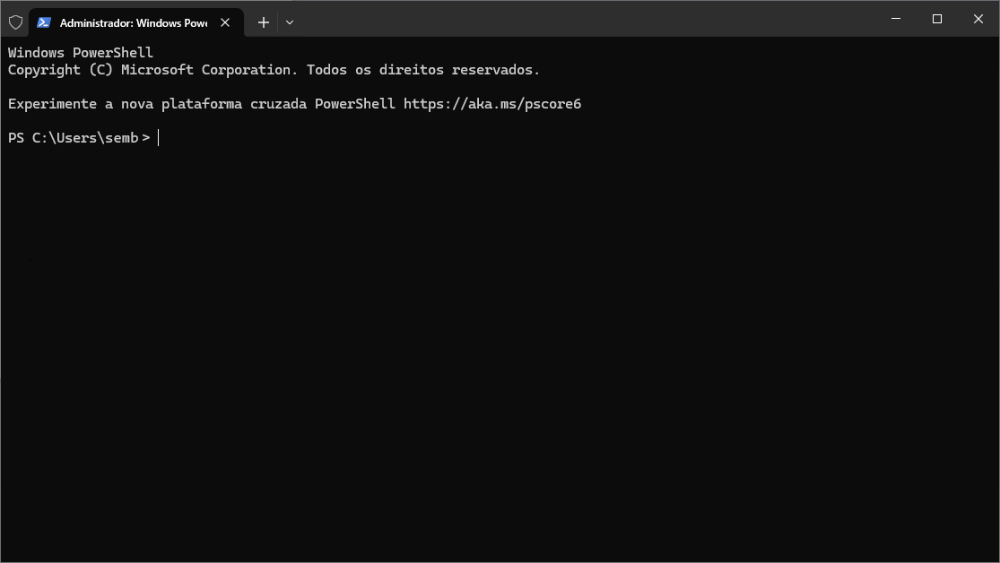

O WSL permite escolher, entre as opções disponíveis, a distribuição Linux de sua preferência. Para ver uma lista das distribuições disponíveis digite o comando:

```console
PS > wsl --list --online
```

Em seguida, instale a distribuição desejada usando **wsl --install -d <Distro>**. Neste curso será utilizada a distribuição **Ubuntu 24.04**. Caso opte por uma distribuição diferente será necessário adaptar as instruções fornecidas.

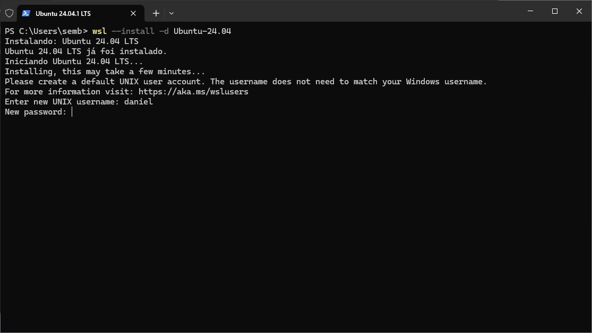

```console
PS > wsl --install -d Ubuntu-24.04
```

Quando a instalação terminar será solicitado que o usuário escolha um nome de usuário e uma senha para este usuário. **ATENÇÃO**, não será mostrado nenhum caractere ao digitar a senha, é assim mesmo, digite a senha e pressione a tecla **ENTER**. Após a criação do usuário o *prompt* do PowerShell será substituído pelo *prompt* do Ubuntu.

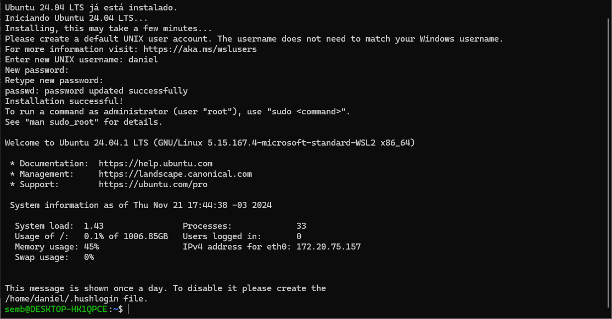

É boa prática manter o sistema operacional atualizado. Para isso, é necessário atualizar a lista de pacotes do sistema, baixar e instalar as atualizações dos
programas instalados. Esta tarefa pode ser realizada utilizando o programa **apt** (*Advanced Packaging Tool*), que é o gerenciador de pacotes padrão do Ubuntu.

Os sistemas operacionais baseados no Unix, dos quais o Linux faz parte, têm a capacidade de definir de forma detalhada as atribuições, direitos de acesso aos arquivos, dispositivos e recursos do sistema operacional. Para atualizar o sistema é necessário direitos de super-usuário (administrador).

Para executar programas e comandos que necessitam de acesso com direitos de super-usuário deve-se utilizar o comando **sudo**, que significa *super user do!*. As linhas de comando a seguir atualizam a lista de pacotes e os programas instalados:

```console
foo@bar$ sudo apt update
foo@bar$ sudo apt upgrade
```

O *apt* executa com direitos de acesso de super-usuário, logo será solicitada a senha de administrador, a mesma que foi criada durante o processo de instalação do Ubuntu.

Antes de iniciarmos a instalação das ferramentas necessárias para configuração
do ambiente de desenvolvimento vamos criar um diretório para salvarmos os
arquivos que baixarmos da internet e outro que servirá de espaço de trabalho
para atividades de laboratório.

```console
foo@bar$ cd
foo@bar$ mkdir Downloads
foo@bar$ mkdir semb1-workspace
```

O comando **cd** (*Change Directory*) é utilizado para alterar o diretório
atual. Quando utilizado sem parâmetros o diretório é alterado para a pasta
*home* do usuário. A pasta *home* é o local onde você pode armazenar seus
arquivos pessoais no Linux. Geralmente o diretório *home* possui o caminho
***/home/usuario***. Você pode consultar o caminho do diretório atual
utilizando o comando **pwd**.

O comando **mkdir** (*Make Directory*) é utilizado para criar novos diretórios.
Os comando acima criaram os diretórios ***/home/usuario/Downloads*** e 
***/home/usuario/semb1-workspace***. Utilizaremos o diretório Downloads para
salvar arquivos e programas baixados da internet e o diretório semb1-workspace
para nossas atividades de laboratório.

### 4.2 - Instalação do compilador e da ferramenta de controle de versões

É necessário instalar também algumas ferramentas básicas tais como  o compilador [GCC - GNU C Compiler](https://gcc.gnu.org/) e ferramenta de controle de versões *Git*. Para instalar estas ferramentas digite o comando abaixo:

```console
foo@bar$ sudo apt install build-essential git
```

Após finalizar o processo de instalação verifique se o **gcc** e o **git** foram instalado corretamente.

```console
foo@bar$ gcc --version
```

```console
foo@bar$ git --version
```

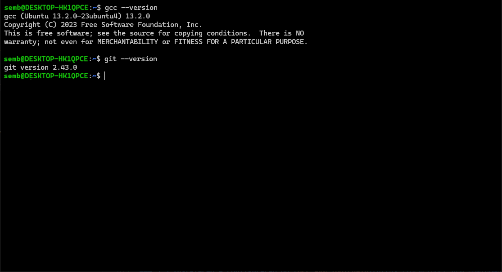

Para poder utilizar corretamente o **git** é necessário, pelo menos, informar o nome de usuário e o e-mail.

```console
foo@bar$ git config --global user.name "seu nome aqui"
foo@bar$ git config --global user.email "seu e-mail aqui"
```
Os arquivos necessários para realização das atividades de laboratório serão
dsponibilizados por meio de repositórios **git**. Um repositório, ou repo, é 
um diretório onde os arquivos do seu projeto ficam armazenados. Ele pode ficar
hospedado na nuvem, no GitHub ou no Bitbucket por exemplo, ou em uma pasta no
seu computador. No repositório você pode armazenar códigos, imagens, áudios,
ou qualquer outro arquivo relacionado ao projeto.

Para baixar ou copiar os arquivos de um repositório **git** utilizaremos o
comando **git clone**. O principal objetivo deste comando é obter uma cópia
exata de todos os arquivos de um repositório remoto para um repositório
local. Por padrão, todo o histórico deste repositório é copiado também. Assim,
para baixar os arquivos necessário para o **Laboratório-01** execute os
seguintes comandos:

```console
foo@bar$ cd semb1-workspace
foo@bar$ git clone https://github.com/daniel-p-carvalho/ufu-semb1-2025-01.git ufu-semb-2025-01
```

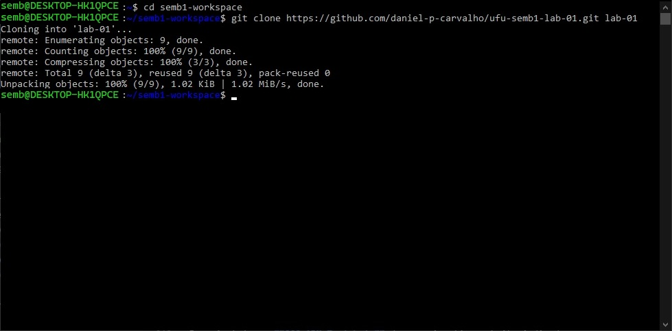

O comando acima *clonou* o conteúdo do repositório remoto
[ufu-semb1-2025-01.git](https://github.com/daniel-p-carvalho/ufu-semb1-2025-01.git)
no diretório local **ufu-semb1-2025-01**. Podemos utilizar o comando **ls** para nos certificarmos
que o diretório foi criado corretamente.

```console
foo@bar$ ls -l
```

Para mais informações sobre o comando **ls** digite:

```console
foo@bar$ man ls
```

### 4.3 Acesso do sistema de arquivos do Linux no Windows Explorer

Em algumas situações pode ser necessário acessar algum arquivo do Linux 
utilizando algum aplicativo Windows ou você queira explorar o sistema de
arquivos Linux de forma gráfica. Para as situações como a descrita podemos
montar o sistema de arquivos do Linux como um ***drive*** de rede.

Para montar o sistema de arquivos do Linux abra uma nova janela do Windows
Explorer e digite na barra de endereços ***\\\\wsl$***. Após pressionar a
tecla **ENTER** você terá acesso ao sistema de arquivos do Linux.

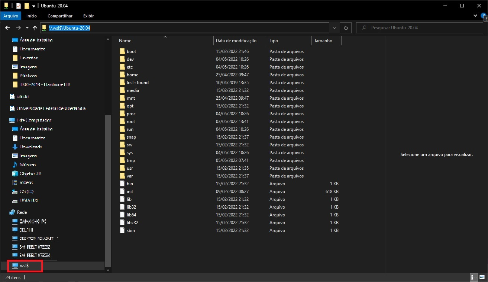

## 5 Integração de Dispositivos USB no WSL2

### 5.1 Configuração do WSL2 para utilização de dispositivos USB

O suporte à dispositivos USB não é nativo no WSL2, é utilizado um sistema de compartilhamento de dispositivos USB através de uma rede IP denominado USB/IP ou *USB over IP*. Com o USB/IP é possível compartilhar um dispositivo USB, seja ele uma câmera, um HD externo, mouse, impressora, ou qualquer outro dispositivo utilizando uma rede IP. 

O USB/IP abstrai uma conexão USB em um dispositivo genérico (servidor) e a partir daí transmite os pacotes de dados USB pra outro computador (cliente) via rede. O cliente pode montar seu próprio *USB device* e utilizar os pacotes de dados USB que recebe via rede. Para intruções atualizadas de como utilizar dispositivos USB no WSL2 recomenda-se ir diretamente na página da Microsoft [Conectar dispositivos USB](https://learn.microsoft.com/pt-br/windows/wsl/connect-usb).

A Microsoft adicionou suporte ao USB/IP no WSL a partir do kernel 5.10.60.1. Assim, deve-se primeiramente verificar qual a versão de kernel está instalada utilizando o comando **uname -a**.

```console
foo@bar$ uname -a
```
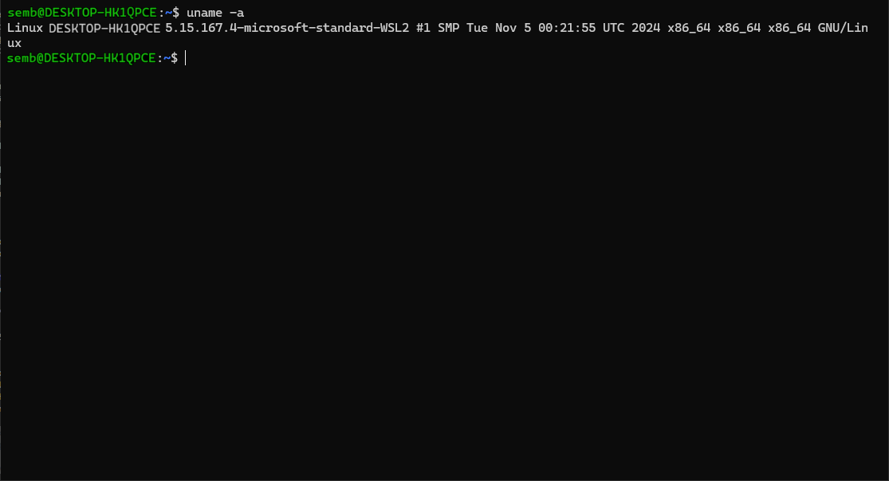

Caso sua vesão do kernel seja inferior à requerida abra o *PowerShell* como administrador e execute o comando abaixo.

```console
PS > wsl --update
```

Para compartilhar dispositivos USB a partir do Windows é necessário instalar o servidor do USB/IP, o **USBIP-WIN**, disponível em [usbipd-win releases](https://github.com/dorssel/usbipd-win/releases). Faça o download da versão mais recente e instale o servidor USB/IP. No momento da redação deste manual a última versão disponível era [usbipd-win 4.3.0](https://github.com/dorssel/usbipd-win/releases/download/v4.3.0/usbipd-win_4.3.0.msi). Alternativamente, pode-se instalar a versão mais recente do **USBIP-WIN** automaticamente utilizando o PowerShell. Para isso utilize o seguinte comando:

```console
PS > winget install usbipd
```

Mais informações a respeito da utilização do **USBIP-WIN** podem ser obtidas em [usbipd-win](https://github.com/dorssel/usbipd-win). Independentemente do processo de instalação utilizando, ao final do processo de instalação têm-se

* um serviço chamado *usbipd* (USBIP Device Host);
* uma ferramenta de linha de comando chamada *usbipd*;
* uma regra de *firewall* para permitir que todas as subredes locais conectem ao serviço *usbipd*.

Em alguns casos, o comando usbipd pode não ser reconhecido corretamente, resultando na seguinte mensagem de erro ao tentar executá-lo:

```console
usbipd : O termo 'usbipd' não é reconhecido como nome de cmdlet, função, arquivo de script ou programa operável.
Verifique a grafia do nome ou, se um caminho tiver sido incluído, veja se o caminho está correto e tente novamente.
No linha:1 caractere:1
+ usbipd --help
+ ~~
    + CategoryInfo          : ObjectNotFound: (usbipd:String) [], CommandNotFoundException
    + FullyQualifiedErrorId : CommandNotFoundException
```

Esse erro ocorre porque o Windows não conseguiu localizar o executável usbipd.exe no ambiente de sistema. Isso pode ser causado por um dos seguintes motivos:

* O diretório de instalação do usbipd-win não está presente na variável de ambiente PATH.
* A instalação não foi concluída corretamente.
* O terminal precisa ser reiniciado para reconhecer as mudanças no PATH.

Se o erro continuar mesmo após reiniciar o terminal, será necessário verificar se o executável foi instalado corretamente e se o caminho de instalação foi adicionado ao PATH do sistema.

Para verificar se o executável está no local padrão de instalação execute o comando:

```console
PS > Test-Path "C:\Program Files\usbipd-win\usbipd.exe"
```

Se o resultado for **True** , significa que o executável está instalado corretamente.

Em seguida verifique se a pasta que contém o executável foi incluida no **PATH**.

```console
PS> $Env:Path -split ";"
```

Caso o caminho não esteja na lista, com o terminal em modo **administrador**, execute o comando abaixo e, em seguida, reinicie o terminal.

```console
PS > [System.Environment]::SetEnvironmentVariable("Path", $Env:Path + ";C:\Program Files\usbipd-win", [System.EnvironmentVariableTarget]::Machine)
```


Após instalar o servidor no Windows devemos instalar o cliente USB/IP e o banco de dados de identificadores USB no Linux. Para informações detalhadas consulte [Connecting USB devices to WSL](https://devblogs.microsoft.com/commandline/connecting-usb-devices-to-wsl/).

No Ubuntu devem ser instalados os pacotes **linux-tools-generic** e **hwdata**. Para isso, digite os comando abaixo.

```console
foo@bar$ sudo apt install linux-tools-generic hwdata
foo@bar$ sudo update-alternatives --install /usr/local/bin/usbip usbip /usr/lib/linux-tools/*-generic/usbip 20
```

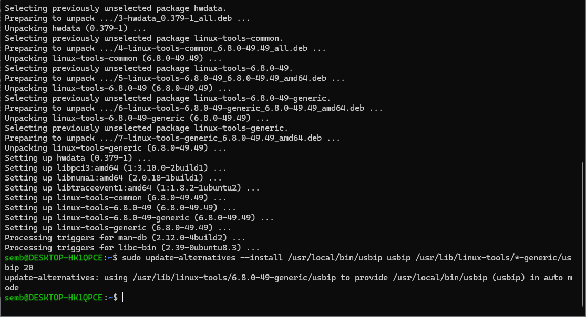

Antes de utilizar o gravador **ST-LINK** certifique-se que o terminal do Ubuntu está aberto e que o serviço [*udev*](https://wiki.archlinux.org/title/Udev) está rodando. Para isso, digite o seguite comando:

```console
foo@bar$ sudo service udev restart
```

Caso queira verificar o status do serviço udev e verificar que ele foi reiniciado, digite o comando abaixo.

```console
foo@bar$ sudo service udev status
```

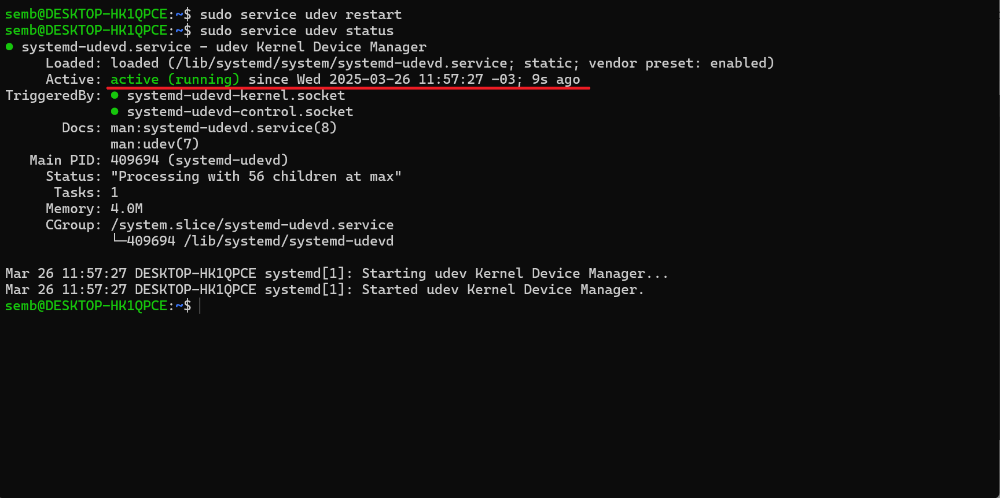

### 5.2 Conexão do gravador **ST-LINK** no WSL2

Antes de mais nada, baixe e instale o *driver* de dispositivo USB do **ST-LINK** para Windows, disponível em [ST-LINK driver](https://www.st.com/en/development-tools/stsw-link009.html). Conecte o gravador e verifique se o driver foi instalado corretamente. Isto pode ser feito através do *Gerenciador de Dispositivos*.

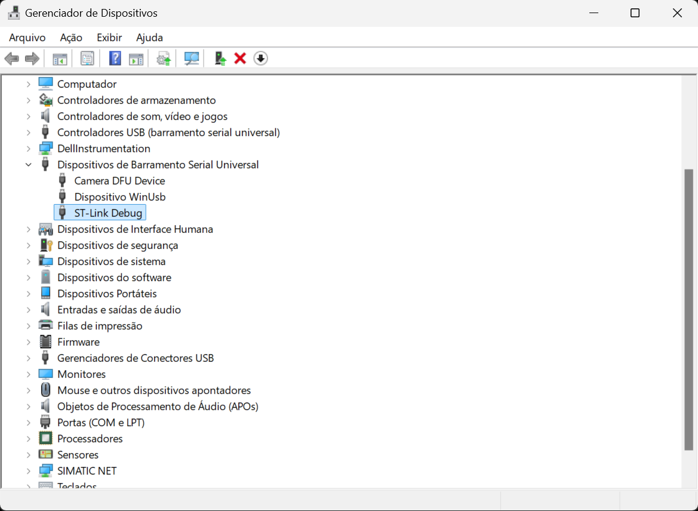

Para utilizar o **ST-LINK**, ou qualquer outro dispositivo USB, no Ubuntu no WSL2 é necessário "transferir o controle" do dispositivo para o WSL2. Isto pode ser feito por meio do terminal do **Windows PowerShell** em modo administrador. Assim, abra o terminal em modo administrador e liste os dispositivos USB conectados à máquina através do seguinte comando:

```console
PS >  usbipd list
```

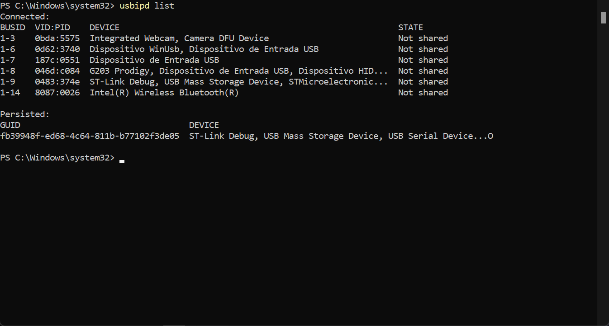

Como pode se notar na saída do comando **usbipd list** o **ST-LINK** está conectado ao **BUSID 1-9** este identificador será utilizado para compartilhar o dispositivo com o WSL2. Para isso, utilize o comando **usbipd bind**. É importante ressaltar que o BUSID pode mudar de acordo com a porta utilizada para conectar o ST-LINK.

```console
PS > usbipd bind --busid 1-9
```

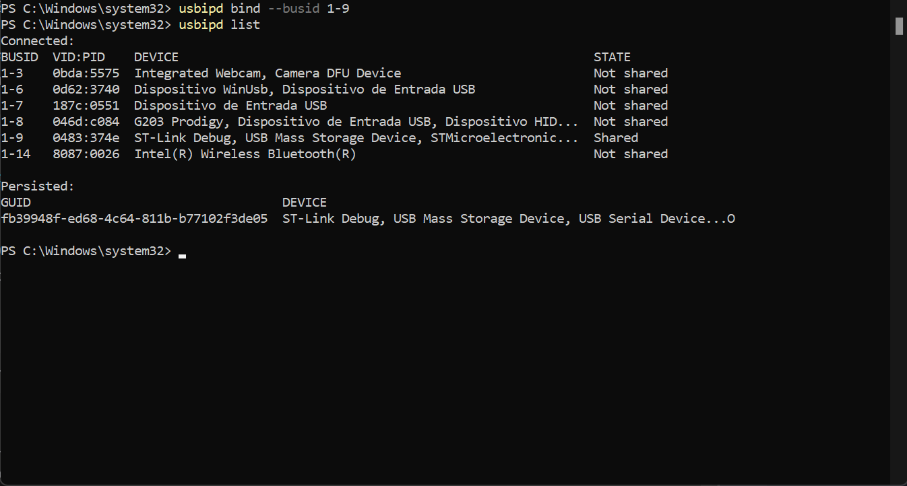

Em seguida, pode-se iniciar a conexão entre o dispositivo e o WSL2 através do comando attach  **usbipd attach**.


```console
PS > usbipd attach --wsl --busid 1-9
```

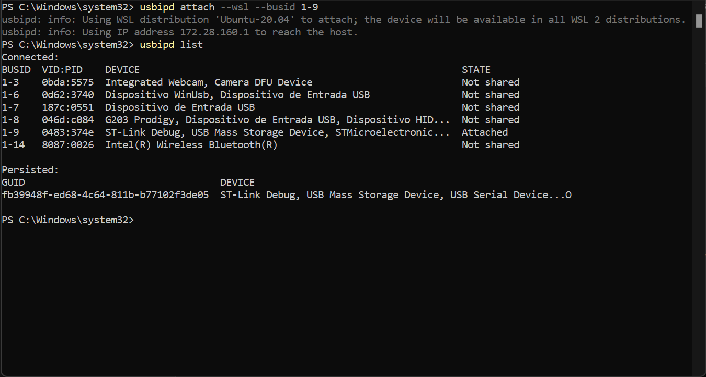

Por fim, no terminal do Ubuntu, pode-se verificar que a conexão ocorreu com êxito.

```console
foo@bar$ lsusb
```

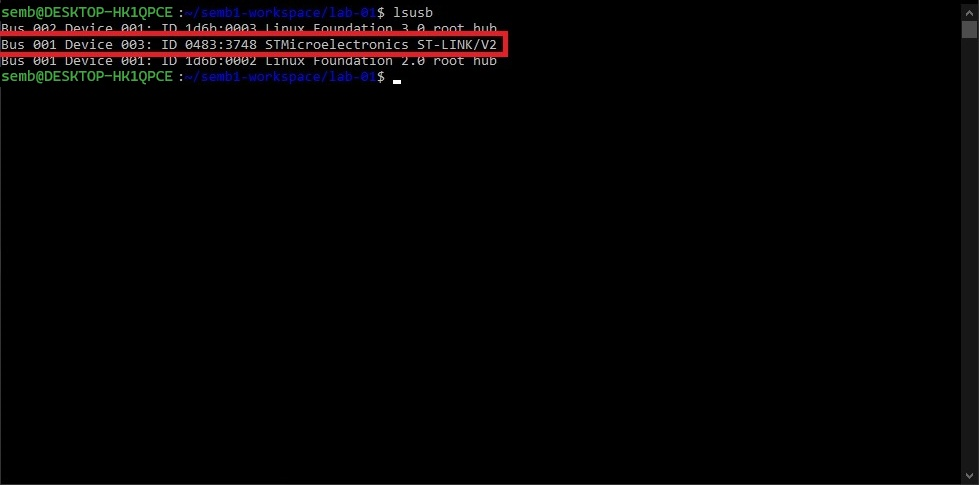

Os sistemas operacionais baseados no Unix, dos quais o Linux faz parte, têm a
capacidade de definir de forma detalhada os direitos de acesso aos arquivos,
dispositivos e recursos do SO. Para verificar se seu usuário tem acesso ao
ST-LINK execute o comando

```console
foo@bar$ ls -l /dev/bus/usb/001/003
```

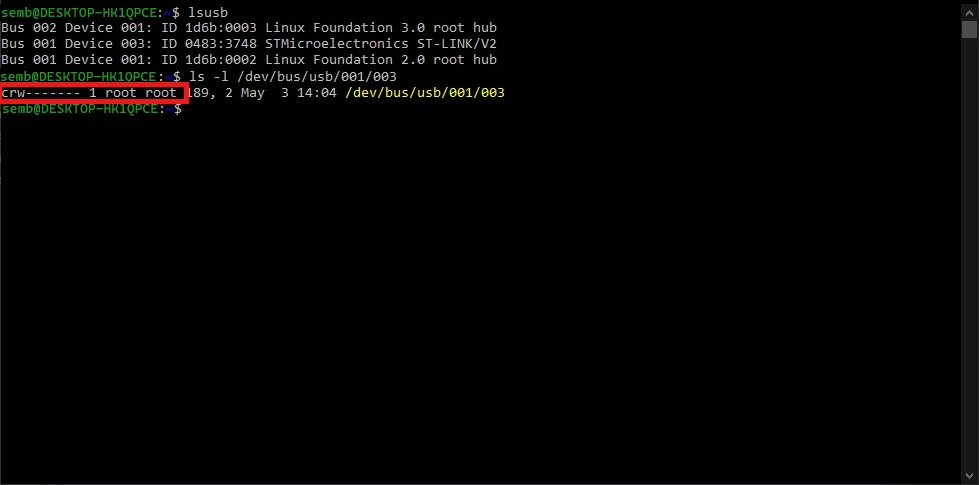

De acordo com a resposta ao comando *ls* este arquivo pertence ao grupo **root**
e ao usuário **root**. Os direitos de acesso a este arquivo são detalhados pelo
conjunto caracteres ```crw-------```. O primeiro caractere indica a natureza do
arquivo que pode ser

* \-: arquivo clássico

* d: diretório

* l: link simbólico

* c: dispositivo do tipo caracter

* b: dispositivo do tipo bloco

* p: pipe (FIFO) ou “tubo”

* s: socket

Neste caso o arquivo representa um dispositivo tipo caracter, o ST-LINK.

Em seguida, temos 3 grupos com 3 caracteres cada, indicando se o arquivo está
autorizado para leitura, escrita ou execução (read, write e execute). Os 3 
grupos correspondem aos direitos de acesso do proprietário, dos membros do
grupo ao qual o usuário pertence e de outros usuários. As letras ```rwx``` são
usadas para simbolizar essas permissões. Se a permissão não for concedida,
a letra em questão é substituída por -. Para este arquivo apenas o usuário
**root** tem o direito de leitura e escrita. Logo, teremos que alterar os
direitos de acesso a este arquivo para podermos utilizar o ST-LINK.

A melhor forma de alterar os direitos de acesso aos arquivos relacionados à
dispositivos USB é utilizar o **udev**. O **udev** é um subsistema do Linux
para gerenciamento de eventos de dispositivos. Falando de maneira simplificada
o **udev** executa um *script* receber um evento de algum dispositivo, por
exemplo, ao conectarmos um dispositivo USB.

Os ***scripts*** necessários para ajustar os direitos de acesso ao **ST-LINK**
estão na pasta ***ufu-semb1-2025-01/pratica/laboratorios/LAB-01***. Acesse a pasta do laboratório e copies todos os
arquivos do diretório ***config/udev/rules.d*** para o diretório
***/etc/udev/rules.d***

```console
foo@bar$ cd
foo@bar$ cd semb1-workspace/ufu-semb1-2025-01/pratica/laboratorios/LAB-01
foo@bar$ sudo cp config/udev/rules.d/49-stlink* /etc/udev/rules.d
```

Reinicie o servço **udev** e recarregue as regras

```console
foo@bar$ sudo service udev restart
foo@bar$ sudo udevadm control --reload
```

Para verificar se as permissões serão configuradas corretamente desconecte o
ST-LINK do WSL. Vá até o terminal do *PowerShell* e digite

```console
PS >  usbipd wsl detach --busid 1-9
PS >  usbipd wsl list
```

Conecte novamente o ST-LINK ao WSL 

```console
PS >  usbipd wsl attach --busid 1-9
```

vá até o terminal do Ubuntu e verifique os direitos de acesso ao dispostivo.
Observe que o número de dispositivo vinculado ao ST-LINK mudou. Agora ele está
disponível no **BUS 001** e **Device 004**.

```console
foo@bar$ lsusb
foo@bar$ ls -l /dev/bus/usb/001/004
```


Como pôde notar os direitos de acesso foram alterados de forma que qualquer
usuário tenha acesso a leitura e escrita no dispositivo ST-LINK.

Conecte o programador **ST-LINK**, sem nada conectado a ele, e execute o
seguinte comando

```console
foo@bar$ sudo apt install stlink-tools
foo@bar$ st-info --probe
```

Caso o sistema tenha sido configurado corretamente você deverá obter uma
resposta como a da figura abaixo

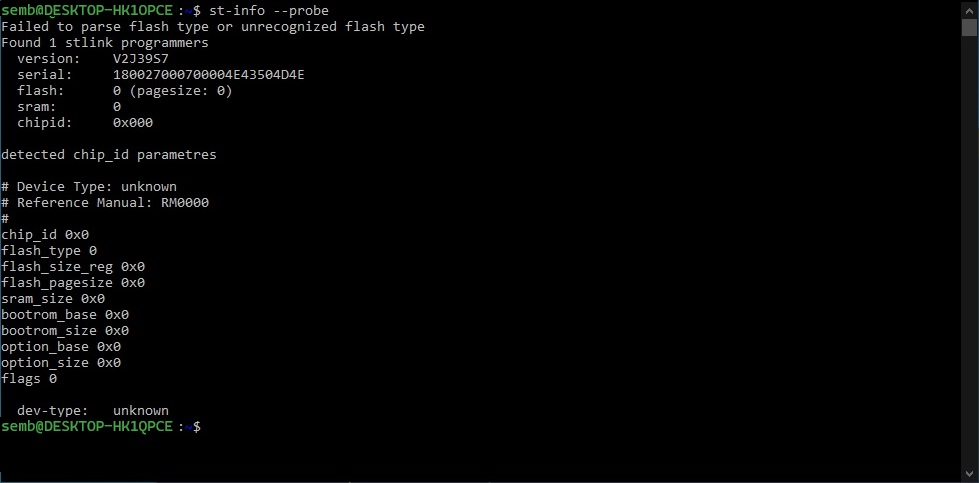

## 6. Instalação e configuração do GCC ARM Toolchain

Para instalar o GCC ARM Toolchain é necessário acessar o website  [ARM developer](https://developer.arm.com/downloads/-/arm-gnu-toolchain-downloads) e baixar o arquivo com uma versão pré-compilada do toolchain para Linux. 

Na ocasião da escrita deste texto a última versão disponível era de dezembro de 2024. Para utilizá-la, copie o endereço do link [arm-gnu-toolchain-14.2.rel1-x86_64-arm-none-eabi.tar.xz](https://developer.arm.com/-/media/Files/downloads/gnu/14.2.rel1/binrel/arm-gnu-toolchain-14.2.rel1-x86_64-arm-none-eabi.tar.xz). Em seguida navegue até o diretório Downloads e baixe o toolchain.

```console
foo@bar$ cd
foo@bar$ cd Downloads
foo@bar$ wget https://developer.arm.com/-/media/Files/downloads/gnu/14.2.rel1/binrel/arm-gnu-toolchain-14.2.rel1-x86_64-arm-none-eabi.tar.xz
```

Após o término do download descompacte o arquivo no diretório /usr/share.

```console
foo@bar$ sudo tar -xJf arm-gnu-toolchain-14.2.rel1-x86_64-arm-none-eabi.tar.xz  -C /usr/share/
```

Para facilitar a utilização vamos criar links simbólicos dos programas fornecidos pelo toolchain no diretório /usr/bin/.

```console
foo@bar$ sudo ln -s /usr/share/arm-gnu-toolchain-14.2.rel1-x86_64-arm-none-eabi/bin/* /usr/bin/
```

Por fim, deve-se instalar as dependências necessárias para a utilização do toolchain.

```console
foo@bar$ sudo apt install libncurses-dev libtinfo-dev
foo@bar$ sudo ln -s /usr/lib/x86_64-linux-gnu/libncurses.so.6 /usr/lib/x86_64-linux-gnu/libncurses.so.5
foo@bar$ sudo ln -s /usr/lib/x86_64-linux-gnu/libtinfo.so.6 /usr/lib/x86_64-linux-gnu/libtinfo.so.5
```
Verifique se o toolchain foi instalado correntamente por meio dos comandos:

```console
foo@bar$ arm-none-eabi-gcc --version
foo@bar$ arm-none-eabi-g++ --version
foo@bar$ arm-none-eabi-gdb --version
```
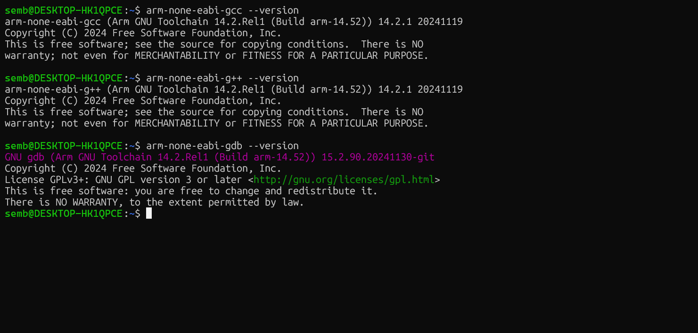

## 7 - Instalação das ferramentas de gravação e depuração de código

### 7.1 Instalação e configuração do [OpenOCD](https://openocd.org/)

O **OpenOCD**, ou Open On-Chip Debugger, é uma ferramenta de código aberto utilizada para depuração, programação e teste de microcontroladores e processadores embarcados. Ele fornece uma interface entre um ambiente de desenvolvimento no computador e o hardware alvo, permitindo operações como execução de código passo a passo, definição de pontos de interrupção, download de *firmware* e muito mais. 

O **OpenOCD** suporta uma ampla variedade de arquiteturas e interfaces de hardware, como **JTAG** e **SWD**, tornando-o bastante versátil para diferentes plataformas. Para utilizá-lo, é necessário um adaptador de hardware para conectar o computador ao sistema embarcado, normalmente através da interfaces USB. Eleé frequentemente usado em conjunto com ambientes de desenvolvimento integrados (IDEs) e outras ferramentas de depuração, como o **GDB** (GNU Debugger).

A instalação do **OpenOCD** no Ubuntu pode ser facilmente realizada utilizando o gerenciador de pacotes **apt**. Para isso, digite o comando:

```console
foo@bar$ sudo apt install openocd
foo@bar$ openocd --version
```

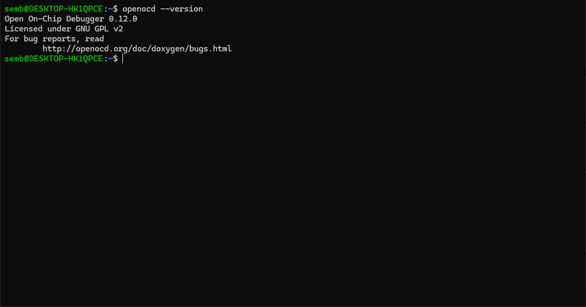

Alternativamente, caso se deseje uma versão atualizada, pode realizar a compilação do **OpenOCD** diretamente do repositório oficial. Para isso, certifique-se de remover qualquer versão previamente instalada.

```console
foo@bar$ sudo apt remove openocd
```

A primeira coisa a ser feita para se compilar o **OpenOCD** é baixar o código fonte a partir do repositório oficial. Para isso, crie uma pasta **Downloads** no diretório home do usuário.

```console
foo@bar$ cd
foo@bar$ mkdir Downloads
foo@bar$ cd Downloads
```

Em seguida, clone o código fonte do **OpenOCD** para esta pasta.

```console
foo@bar$ git clone https://github.com/openocd-org/openocd openocd-code
foo@bar$ cd openocd-code
```

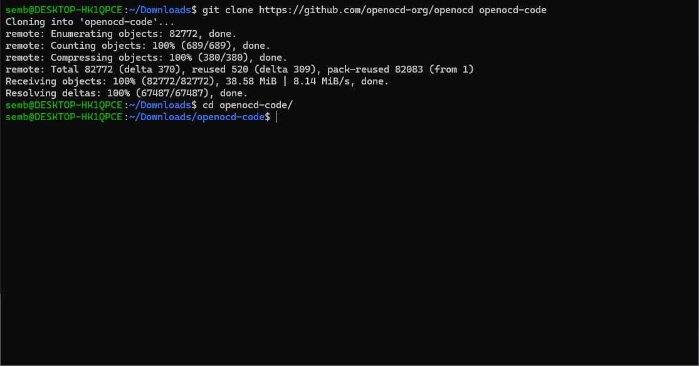

Informações detalhadas sobre a utilização, dispositivos suportados e como compilar o **OpenOCD** a partir do repositório podem ser obtidas no arquivo **README**.

Para compilar o **OpenOCD** é necessário alguns pacotes adicionais são eles:

* make (instalado);
* libtool;
* pkg-config >= 0.23 (ou compatível);
* autoconf >= 2.69;
* automake >= 1.14;
* texinfo >= 5.0;
* libusb-1.0;
* libjaylink.
* libjim >= 0.79;

Estes pacotes podem ser instalados através do comando:

```console
foo@bar$ sudo apt install libtool pkg-config autoconf automake texinfo libusb-1.0-0-dev libjaylink-dev libjim-dev
```

Uma das vantagens de se compilar o **OpenOCD** através do repositório é a possibilidade de escolher a versão que será utilizada. para isso utilize o comando:

```console
foo@bar$ git tag
```

Neste guia será utilizada a versão **0.12**, a mesma disponibilizada pelo gerenciador de pacotes. Para selecionar a versão **0.12** digite:

```console
foo@bar$ git switch --detach v0.12.0
```

Após a seleção da versão, pode-se prosseguir para o processo de configuração e compilação. A primeira tarefa é gerar os arquivos de compilação, isso é feito através do *script* ***bootstrap*** disponibilizado junto com o código fonte. Este *script* baixa submódulos, checa dependencias de biblioteca e prepara o processo de compilação.

```console
foo@bar$ ./bootstrap
```

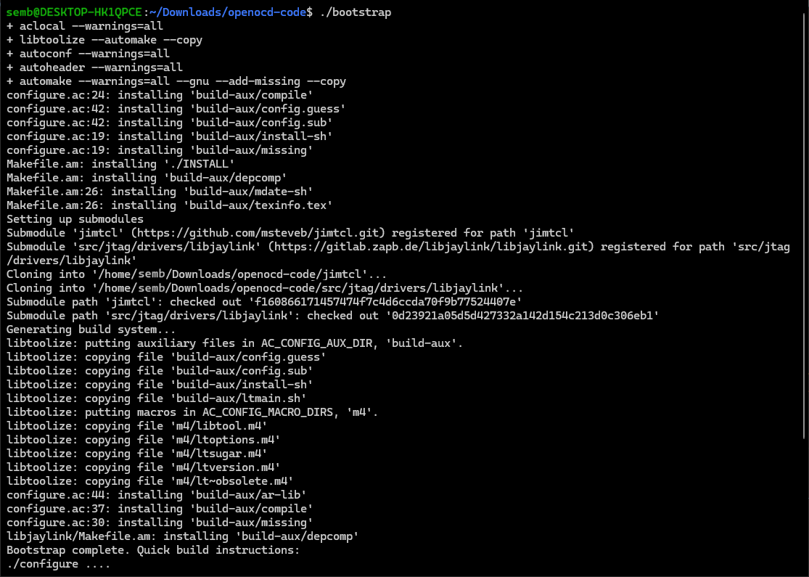

Em seguida execute:

```console
foo@bar$ ./configure --enable-stlink --enable-jlink
```

Após a execução do comando, certifique-se que os programadores **ST-LINK** e **J-LINK** foram configurados corretamente.

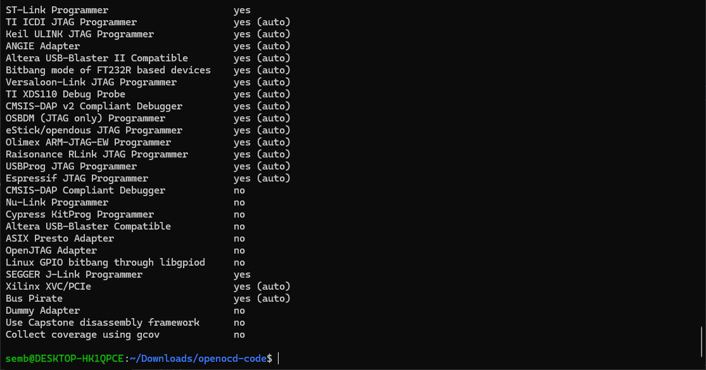

O restante do processo de compilação segue a sequência tradicional, **make** e **make install**.

```console
foo@bar$ make
foo@bar$ sudo make install
```

Para verificar se o **OpenOCD** foi instalado corretamente digite o comando:

```console
foo@bar$ openocd --version
```

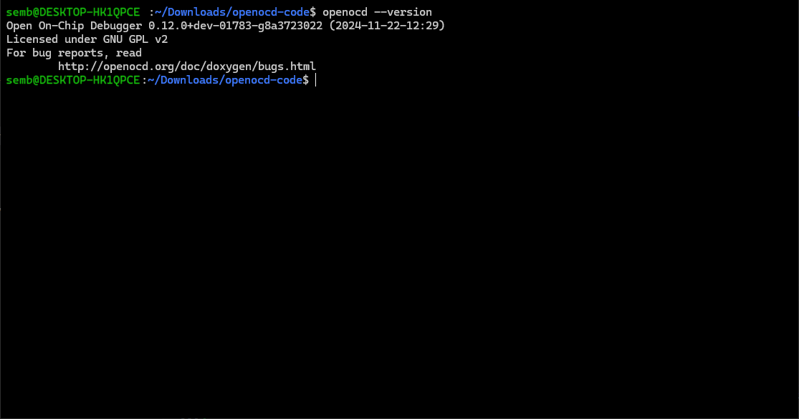

### 7.2 - Ferramentas de código aberto ST-LINK

As ferramentas de código aberto ST-LINK também podem ser utilizadas para
gravar e depurar programas desenvolvidos para dispositivos *STM32*. Iremos
utilizar as seguintes aplicações:

* **st-info** - a programmer and chip information tool
* **st-flash** - a flash manipulation tool
* **st-util** - a GDB server (supported in Visual Studio Code / VSCodium via the Cortex-Debug plugin)

Conforme mostrado na sessão 5.2, as ferramentas **stlink** podem ser instaladas utilizando o utilitário **apt**.

```console
foo@bar$ sudo apt install stlink-tools
```

A versão disponibilizada pelo **apt** é antiga logo, iremos optar por compilar
a versão estável mais recente disponibilizada no repositório oficial 
[stlink-org](https://github.com/stlink-org/stlink). Informações detalhadas de
como compilar as ferramentas podem ser obtidas na documentação disponiblizada no
repositório. 

Antes de compilar e instalar as ferramentas **stlink** do repositório oficial
certifique-se de remover a versão instalada utilizando o gerenciador de pacotes

```console
foo@bar$ sudo apt remove stlink-tools
```

Navegue até o diretório *Downloads* e clone o repositório

```console
foo@bar$ cd
foo@bar$ cd Downloads
foo@bar$ git clone https://github.com/stlink-org/stlink stlink-tools
```

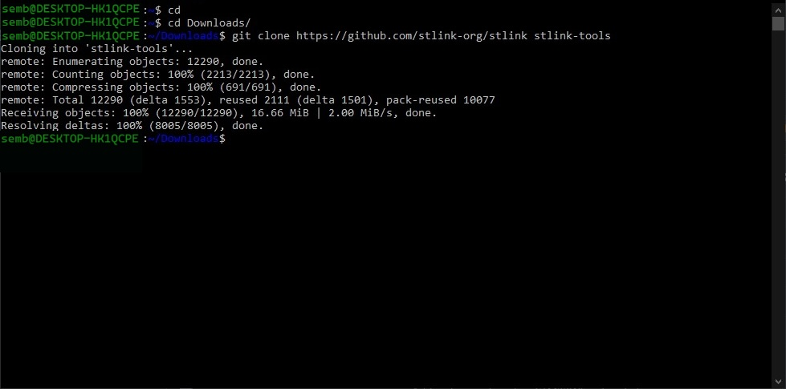

Para compilar as ferramentas **stlink** é necessário instalar os pacotes a
seguir:

* git;
* gcc (provavelmente instalado);
* build-essential (distribuições baseadas no Debian como o Ubuntu);
* cmake;
* libusb-1.0;
* libusb-1.0-0-dev (arquivos de cabeçalho utilizados na compilação);
* libgtk-3-dev (opcional, utilizada para a aplicação stlink-gui);
* pandoc (opcional, needed for generating manpages from markdown)

Iremos instalar apenas os pacotes necessários

```console
foo@bar$ sudo apt install git build-essential cmake libusb-1.0-0 libusb-1.0-0-dev
```

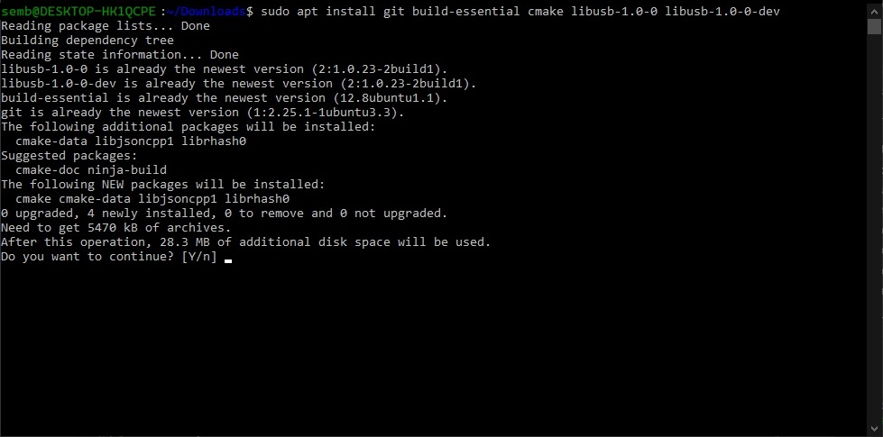

Navegue até o diretório do código fonte e liste as versões estáveis disponíveis:

```console
foo@bar$ cd stlink-tools
foo@bar$ git tag
```

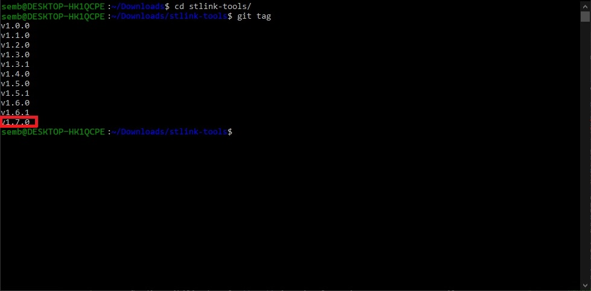

Desejamos compilar a versão estável mais recente logo, necessitamos alterar
o *branch* para a *tag* da versão desejada:

```console
foo@bar$ git switch -c v1.7.0
```

Para compilar e instalar as ferramentas **stlink** execute os seguintes comandos

```console
foo@bar$ make clean
foo@bar$ make release
foo@bar$ sudo make install
```

Pode ser necessário atualizar as bibliotecas de vínculo dinâmico do sistema. Para isso execute o comando **ldconfig**

```console
foo@bar$ sudo ldconfig
```

Verifique se as ferramentas **stlink** foram instaladas corretamente

```console
foo@bar$ st-flash --version
foo@bar$ st-info --version
foo@bar$ st-trace --version
foo@bar$ st-util --version
```

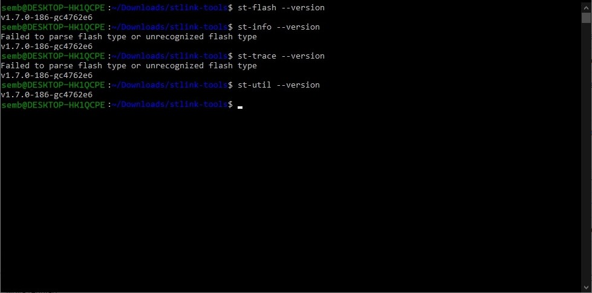

## 8 - Instalação do IDE Visual Studio Code

O **Visual Studio Code** (VS Code) é um Ambiente de Desenvolvimento Integrado
(*Integrated Development Environment - IDE*) de código aberto desenvolvido
pela Microsoft disponível para Windows, Mac e Linux.

O **VS Code** a princípio é uma ferramenta simples e leve e tem como 
funcionalidades básicas:

* edição de código com suporte a várias linguagens de programação;
* terminal de comandos integrado;
* controle de versão;

Estas funcionalidades podem ser facilmentes estendidas utilizando a loja de
extensões.

Vamos utilizar a versão para **Windows** do **VS Code** que pode ser facilmente
integrado ao **WSL** utilizando extensções. Para instalar o **VS Code** faça o
*download* do arquivo do instalador em https://code.visualstudio.com/download
e siga as instruções para a instalação. Ao término do processo de instalação
abra o **VS Code**. Caso deseje instale o pacote de idiomas
**Portuguese Brazil**.

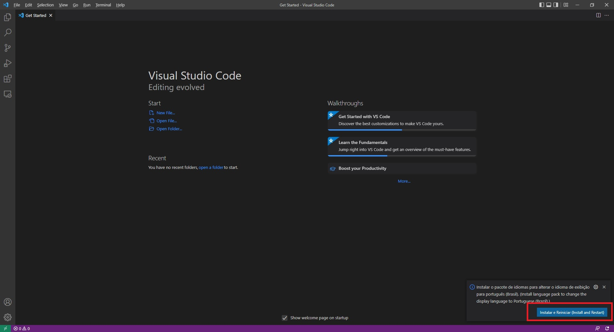

Agora vamos utilizar as extensões para customizar o **VS Code** para acessar o
**WSL** e adicionar ferramentas para edição e depuração de códigos em linguagem
C.

Abra a loja de extensões do **VS Code** clicando no ícone *Extensions* ou 
utilizando as teclas de atalho **CTRL + SHIFT + X** pesquise pela extensão 
**Remote - WSL** e realize a instalação. Pode ser necessário reiniciar o
**VS Code**.

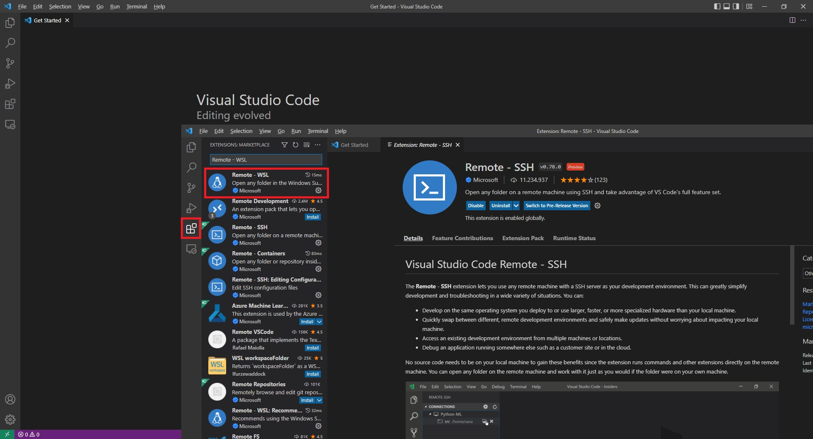

Para instalar as ferramentas de suporte à edição de código em Linguagem C
pesquise na loja de extensões por **C/C++** e instale as seguintes extensões

* C/C++;
* C/C++ Extension Pack; e,
* C/C++ Themes.

Observe na seção *Overview and tutorials* que existem diversos *links* para
exemplos e tutoriais de como utilizar a extensão.

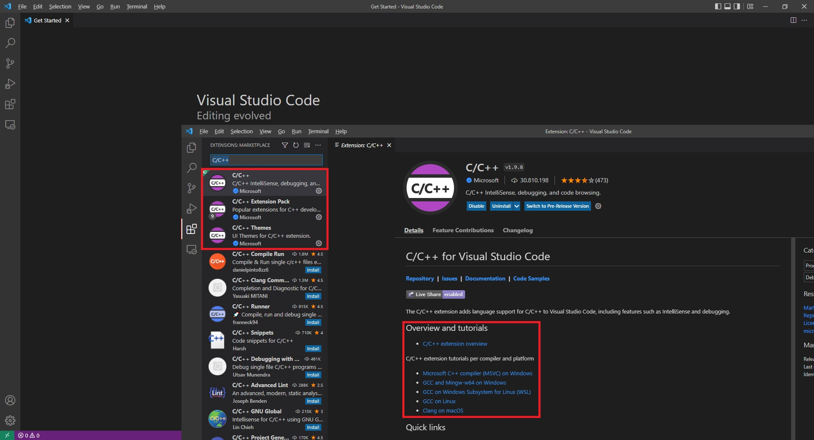

Instale também a ferramenta para depuração de dispositivos *ARM Cortex-M*.
Pesquise na loja de extensões por **Cortex-Debug** e instale a extensão

* **Cortex-Debug**

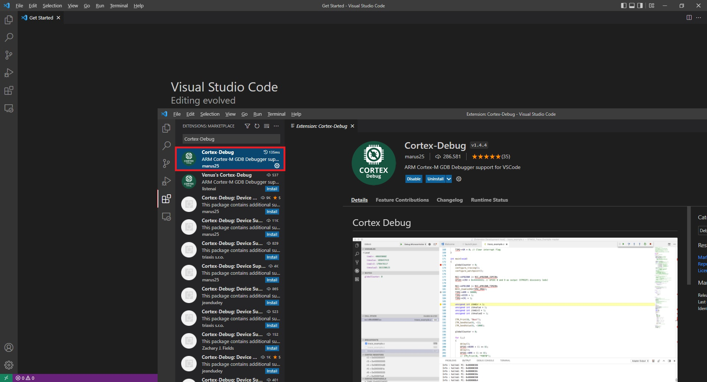

Para utilizar o **VS Code** em conjunto com o **WSL** clique no ícone verde, no
canto inferior esquerdo, e abra uma nova janela remota do **VS Code**.

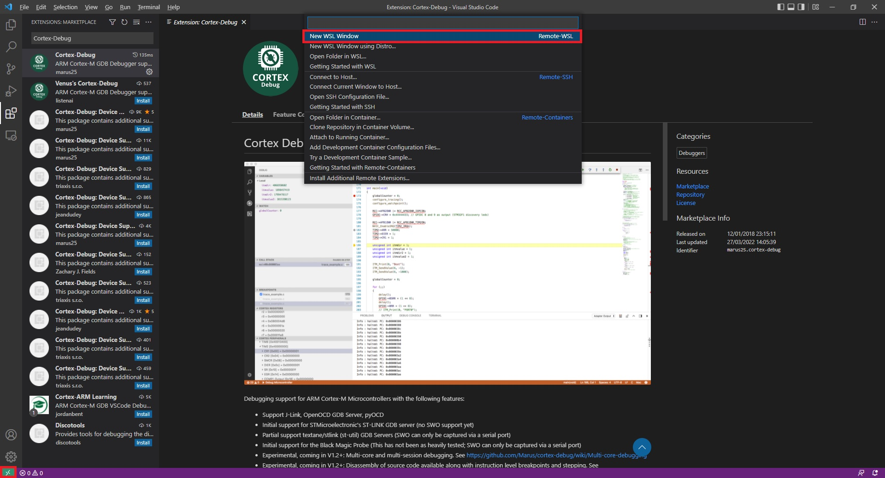

Na nova janela do **VS Code** abra loja de extensões e instale no **WSL** as
extensões instalaladas localmente. Selecione

* C/C++;
* C/C++ Extension Pack;
* C/C++ Themes; e,
* **Cortex-Debug**.

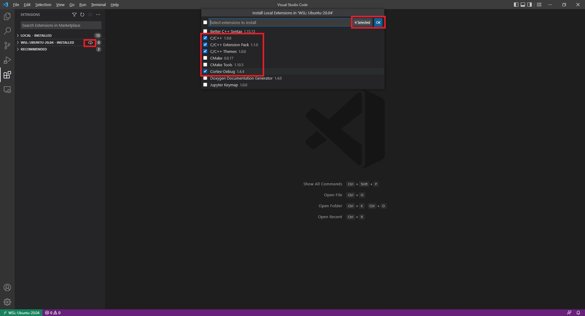